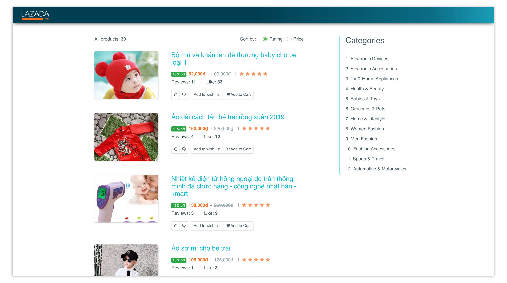
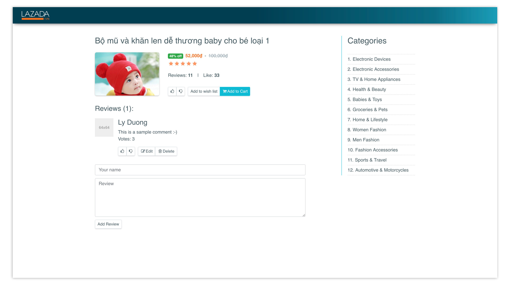
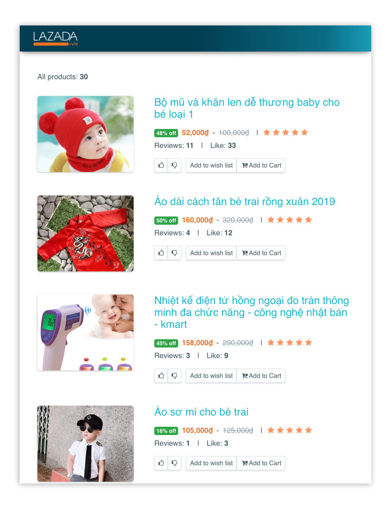

# Laz 

## I. What is this?

An assignment :-). It's actually a list of products and the details of each.

Implemented using some notable libraries:

Front-end:
- React
- Redux
- Bootstrap (v.4)
- Webpack

Back-end:
- A simple ExpressJs server

View best on Chrome, and a screen size of 1440px x 900px (well, cause I did it on such an environment...)

Live demo: https://laz-be.herokuapp.com/

## II. What have been done?

- A responsive home page that lists all products
- A responsive detail page for each
- You actually can add review for each products, but it's not gonna be persisted though ;)
- And I did the webpack configuration!

## III. What could be improved?

Well, due to time constraint, the following items were intended, but were not implemented, but could be improved though:

- Loading performance > improve Google PageSpeed Insight Score
- Rendering performance > to comply with the RAIL performance model
- Maybe optimized for other browsers? and unit test?
- Infinite scrolling to load more products.
- Some more APIs to handle updating the reviews/votes/likes
- Any some other pending TODO items you may find in the source code ;) 
...

## IV. Installation

### 1. Back-end

- Install packages: `yarn install` or `npm install`
- Launch server: `node server`
- Unless modified in `config.js` server will use port `5001`

### 2. Front-end

- Navigate to the "front-end" folder: `cd front-end`
- Install packages: `yarn install` or `npm install`
- For development, run: `yarn start` or `npm start`
- For deployment, with compressed js/css, run: `yarn build` or `npm build`

## V. Screenshots:

#### A. Home page:

#### B. Detail page:

#### C. iPad version:

#### D. iPhone version:

